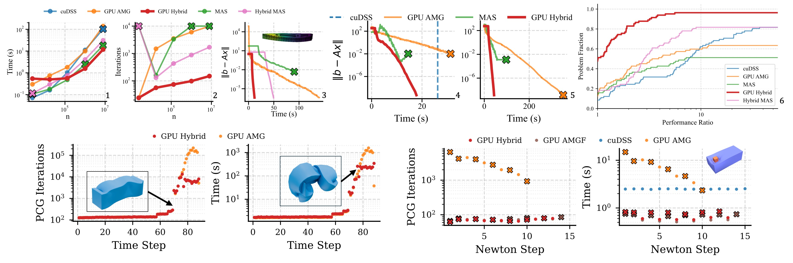

# [Siggraph Asia 2026] A Purely Algebraic Solver for Locally Stiff Linear Systems

This repo contains CPU and GPU implementations for a purely algebraic, hybrid linear solver targetting locally stiff problems (e.g., contact, meshes with poor quality stiffness ratios, extreme elastic deformations, etc.). Regions of local stiffness are identified automatically using the $\ell_1$ norm of each row. Then, a 1D Gaussian Mixture Model is used to identify pockets of local stiffness. After additional post-processing steps, a preconditioner that augments algebraic multigrid with a direct factorization of the selected locally stiff degrees of freedom is constructed.

An improved implementation of our solver that can be easily integrated into other projects exists in [PolySolve](https://github.com/polyfem/polysolve) (see the `CPUHybridSolver` and `GPUHybridSolver` classes).



## Installation

The GPU version of our solver requires CUDA 13. The CPU version of our solver requires MPI and MKL. To build:

```bash
mkdir build 
cd build
cmake -DCMAKE_BUILD_TYPE=Release -DCMAKE_C_COMPILER=mpicc -DCMAKE_CXX_COMPILER=mpicxx -DCMAKE_CUDA_HOST_COMPILER=mpicc -DCMAKE_CUDA_ARCHITECTURES=X -DPOLYSOLVE_WITH_CUDA=ON ..
make -j4
```

## Usage

We provide the executable `/build/tests/linear_solve`, which can solve matrices specified by mtx files. The following command will use the solver specified in `params.json` to solve the system specified by `A.mtx` and `b.mtx`:

```bash
./tests/linear_solve -A A.mtx -b b.mtx -j params.json
```

For solvers that may require additional, problem-specific information, we provide additional input options. In addition, users can set benchmarking settings such as the number of times to solve the system. A full list of arguments is included below:

| Option                           | Description                                                                                                                                                                               |
| -------------------------------- | ----------------------------------------------------------------------------------------------------------------------------------------------------------------------------------------- |
| -A <matrix.mtx> (REQUIRED)       | Path to the input Matrix Market sparse matrix.                                                                                                                                            |
| -b <rhs.mtx>                     | Path to Matrix Market vector containing the RHS.                                                                                                                                          |
| --rand [seed=0]                  | Generate a random RHS vector using the given (default 0) random seed.                                                                                                                     |
| -i <problem_info.mtx>            | Path to a Matrix Market vector containing problem-specific information.                                                                                                                   |
| -p <positions.mtx>               | Path to a Matrix Market file specifying spatial node positions.                                                                                                                           |
| -e <elements.mtx>                | Path to a Matrix Market file specifying element connectivity.                                                                                                                             |
| -t, --threshold<double></double> | Threshold value applied to problem-specific information vector.                                                                                                                           |
| --less-than                      | Condition for setting the problematic subspace based on the provided problem-specific information vector. When set, selects info(i) < threshold. Default selects info(i) > threshold.     |
| -j <spec.json>                   | Path to JSON file describing solver settings.                                                                                                                                             |
| --force-symmetry                 | Force input matrix to be treated as symmetric by duplicating off diagonal entries. Required if your Matrix Market file stores only the upper/lower triangular part of a symmetric matrix. |
| -w <int=1>                       | Number of warmup solves to perform before reporting timing information.                                                                                                                   |
| -r <int=1>                       | Number of times to repeat the solve.                                                                                                                                                      |

Example solver configuration files for our CPU and GPU solver can be found in the `spec/` directory.

### Examples

We include two example matrices `mats/` for quick testing, one from a contact problem another from solving the Laplacian on a mesh containing poor quality elements. Note that the former requires `block_size=3`, while the latter should be solved with `block_size=1`. 
 
## Citation

```bibtex
@inproceedings{Paik:2026:PALSS,
  title     = {A Purely Algebraic Solver for Locally Stiff Linear Systems},
  author    = {Paik, Maxwell, and Su, Tzu Hsiang, and Kusupati, Uday, and Kolev, Tzanio, and Panozzo, Daniele, and Zorin, Denis},
  year      = {2026},
  isbn      = {9798400728426},
  publisher = {Association for Computing Machinery},
  address   = {New York, NY, USA},  
  month     = nov,
  series    = {SA Conference Papers ’26},
  booktitle = {SIGGRAPH Asia 2026 Conference Papers (SA Conference Papers '26), December 01--04, 2026, Kuala Lumpur, Malaysia},
  articleno = {91},
  numpages = {10},
  doi       = {10.1145/3829340.3842242}
}
```
